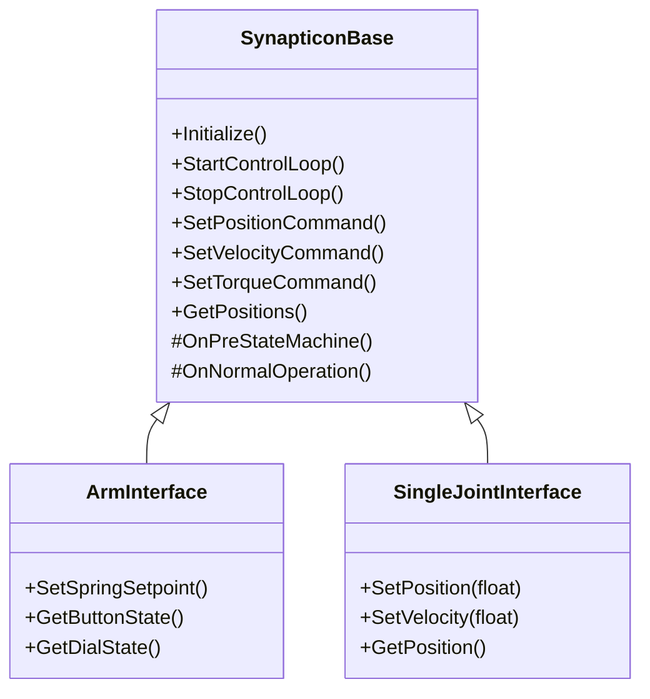

# elevated_control

Pure C++ control interface for Synapticon motor drives over EtherCAT (via the
bundled SOEM library). Provides a generic N-motor base class (`SynapticonBase`)
with specialized subclasses for the Elevate Robotics 7-DOF manipulator
(`ArmInterface`) and single-motor testing (`SingleJointInterface`).

## Cloning

When cloning, add the `--recursive` flag to get the submodules as well:

`git clone --recursive https://github.com/elevaterobotics/elevated_control.git`

## Dependencies

Tested on Ubuntu 24.04:

| Dependency | Purpose |
|---|---|
| **GCC 12+** (or any C++23 compiler) | `std::expected`, `std::jthread` |
| **spdlog** | Logging (`libspdlog-dev`) |
| **yaml-cpp** | Config file parsing (`libyaml-cpp-dev`) |
| **pthread / rt** | Real-time threading (provided by glibc) |

```bash
sudo apt install build-essential cmake libspdlog-dev libyaml-cpp-dev libgtest-dev
```

## Build

```bash
cd elevated_control
mkdir build && cd build
cmake ..
make -j$(nproc)
```

Optionally deploy to `CMAKE_INSTALL_PREFIX`, default `/usr/local`:

```bash
cmake --install .
```

The build produces:

- `libelevated_soem.a` -- static EtherCAT master library (SOEM/OSAL/OSHW)
- `libelevated_control.so` -- shared library with `SynapticonBase`, `ArmInterface`, and `SingleJointInterface`
- `basic_usage` -- minimal example executable that waits for the control loop to be ready then reads the joint positions
- `velocity_commands` -- waits for the control loop to be ready then send 5 seconds of slow wrist roll velocity commands
- `single_motor_test` -- minimal single-motor example: initialize, read position, send velocity commands

## Tests

Tests are built by default and require GTest (`libgtest-dev` on Ubuntu). To
build and run them:

```bash
cd elevated_control
mkdir build && cd build
cmake .. -DBUILD_TESTING=ON
make -j$(nproc)
ctest --output-on-failure
```

To disable tests, configure with `-DBUILD_TESTING=OFF`.

## Usage

Link against `elevated_control` in your CMake project:

```cmake
find_package(spdlog REQUIRED)
add_subdirectory(path/to/elevated_control)
target_link_libraries(my_app PRIVATE elevated_control)
```

See [`examples/basic_usage.cpp`](examples/basic_usage.cpp) for a minimal
program that initializes the arm, reads joint positions, then stops.
It loads `joint_limits.yaml` and `elevate_config.yaml` from the directory
containing the executable (after build, CMake copies them next to
`basic_usage`; after `cmake --install`, they live under
`share/elevated_control/` under the install prefix).

EtherCAT requires root privileges for raw socket access:

```bash
sudo ./my_app
```

## Architecture



**`SynapticonBase`** handles generic EtherCAT communication with any number of
Synapticon motor drives: initialization, cyclic PDO exchange, the CiA 402 state
machine, and streaming position/velocity/torque commands. Derived classes inject
hardware-specific logic through virtual hooks (`OnPreStateMachine`,
`OnNormalOperation`, `OnPostCycle`, `IsEStopEngaged`).

**`ArmInterface`** (inherits `SynapticonBase`) adds 7-DOF arm-specific features:
gravity compensation, friction compensation, hand-guided mode, spring adjust,
dial/button GPIO, joint admittance, and the dynamic simulation thread.

**`SingleJointInterface`** (inherits `SynapticonBase`) is a thin wrapper for
single-motor testing, providing scalar convenience methods (`SetPosition`,
`GetPosition`, etc.) that delegate to the base class vector API.

Two `std::jthread`s run inside `SynapticonBase`:

1. **EtherCAT control loop** -- cyclic PDO exchange at the configured rate,
   per-joint state machine, joint-limit enforcement.
2. **EtherCAT error monitor** -- background thread that recovers lost slaves.

`ArmInterface` adds a third thread:

3. **Dynamic simulation** -- currently a stub (produces zero feedforward torque).
   Will be wired to Drake for gravity compensation and collision checking.

All threads share state through lock-free atomics and are cleanly stopped via
cooperative `std::stop_token` cancellation.

## Control Modes

### Base modes (available for all interfaces via `ControlMode`)

| Mode | Enum | Description |
|---|---|---|
| Position | `ControlMode::kPosition` | Cyclic position (OpMode 8) |
| Velocity | `ControlMode::kVelocity` | Cyclic velocity (OpMode 9) |
| Torque | `ControlMode::kTorque` | Profile torque (OpMode 4) |
| Quick stop | `ControlMode::kQuickStop` | Motor brakes engaged |

### Arm-extended modes (ArmInterface only, via `ControlLevel`)

| Mode | Enum | Description |
|---|---|---|
| Hand-guided | `ControlLevel::kHandGuided` | Zero-torque with friction comp, dial-controlled wrist |
| Spring adjust | `ControlLevel::kSpringAdjust` | PD control of internal spring via potentiometer |

## Project Structure

```
elevated_control/
  CMakeLists.txt
  examples/
    basic_usage.cpp              Minimal arm usage (builds as executable)
    velocity_commands.cpp        Arm velocity control example
    hand_guided.cpp              Arm hand-guided mode example
    spring_adjust.cpp            Arm spring adjust example
    single_motor_test.cpp        SingleJointInterface example
  include/elevated_control/
    synapticcon_base.hpp         Generic N-motor base class
    interface_arm.hpp            7-DOF arm class (inherits SynapticonBase)
    interface_single_joint.hpp   Single-motor class (inherits SynapticonBase)
    types.hpp                    ControlMode, ErrorCode, Error
    types_arm.hpp                7-DOF arm types: ControlLevel, JointName, JointArray
    constants.hpp                Generic EtherCAT constants
    constants_arm.hpp            7-DOF arm joint indices and tuning constants
    somanet_pdo.hpp              Packed PDO structs
    unit_conversions.hpp         Ticks <-> radians, torque conversions
    velocity_filter.hpp          Low-pass filter
    joint_admittance.hpp         Single-joint admittance controller
    joint_limits.hpp             Soft joint-limit enforcement
    config_parsing.hpp           YAML config parsing (arm-specific)
    state_machine.hpp            CiA 402 state machine helpers
    dial_normalization.hpp       Wrist dial input normalization
    spring_adjust.hpp            Spring adjust logic
    dynamic_sim.hpp              Dynamic simulation stub
  src/
    synapticcon_base.cpp         Base class implementation
    interface_arm.cpp            Arm class implementation
    interface_single_joint.cpp   Single-motor class implementation
    joint_admittance.cpp
    velocity_filter.cpp
    config_parsing.cpp
    dynamic_sim.cpp
    spring_adjust.cpp
    osal/                        OS abstraction (from SOEM)
    oshw/                        Hardware abstraction (from SOEM)
    soem/                        Simple Open EtherCAT Master
```
